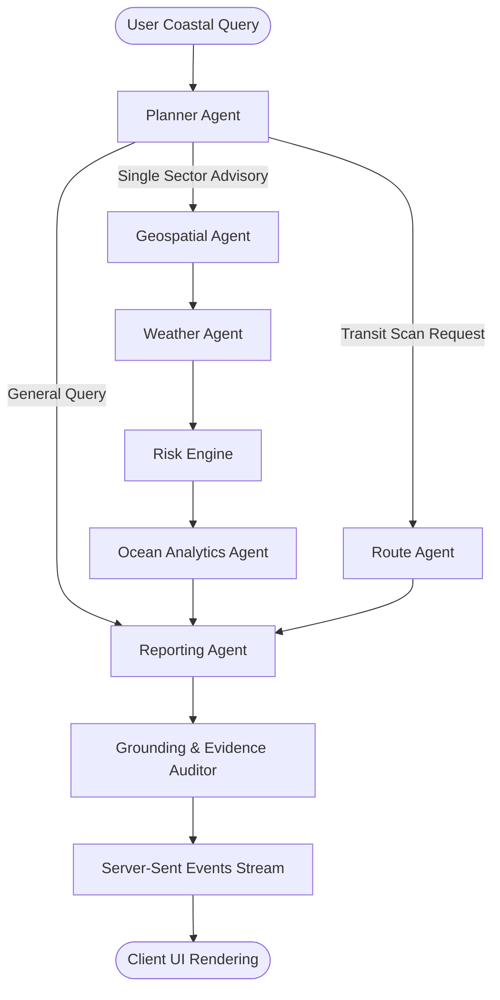

<div align="center">

# ORCA: Marine Ecosystem Reasoning with Collaborative Agents

**Autonomous Multi-Agent Intelligence & Real-Time Ocean Telemetry Platform**

[](https://fastapi.tiangolo.com)
[](https://nextjs.org)
[](https://www.python.org/)
[](https://www.typescriptlang.org/)
[](https://github.com/kishore1035/ORCA)
[](https://www.sih.gov.in/)

</div>

---

## Table of Contents

- [Executive Summary](#executive-summary)
- [Problem Statement & Background](#problem-statement--background)
- [System Architecture](#system-architecture)
- [Multi-Agent LangGraph Pipeline](#multi-agent-langgraph-pipeline)
- [Risk Scoring & Mathematical Formulation](#risk-scoring--mathematical-formulation)
- [Grounded Marine Data Connectors](#grounded-marine-data-connectors)
- [Zero-Fabrication Fallback Contract](#zero-fabrication-fallback-contract)
- [User Experience & Frontend Engine](#user-experience--frontend-engine)
- [API Reference](#api-reference)
- [Installation & Local Setup](#installation--local-setup)
- [Testing & Quality Assurance](#testing--quality-assurance)
- [Repository Structure](#repository-structure)
- [Smart India Hackathon Details](#smart-india-hackathon-details)

---

## Executive Summary

ORCA (Marine Ecosystem Reasoning with Collaborative Agents) is an enterprise-grade agentic intelligence platform designed for coastal fishermen, maritime navigation operators, and ocean researchers.

Traditional maritime interfaces present raw sensor readings, isolated weather forecasts, and complex navigational charts that require specialized maritime training to interpret safely. In critical scenarios, failure to correlate wind gusts, wave swells, and sea-surface temperatures can lead to catastrophic maritime accidents, equipment loss, or unproductive fishing operations.

ORCA resolves this challenge by orchestrating a specialized directed acyclic graph (DAG) of autonomous agents using LangGraph. When presented with natural-language coastal queries, ORCA decomposes intent, extracts geospatial boundaries, ingests verified telemetry from national and international oceanographic institutions, evaluates quantitative safety matrices, and synthesizes grounded, auditable advisories accompanied by live animated workflow traces and geospatial mapping.

---

## Problem Statement & Background

- **Hackathon Theme**: Smart India Hackathon 2024
- **Problem Statement ID**: SIH26176
- **Domain**: Marine Telemetry, Coastal Safety, Autonomous Agent Systems, and Oceanographic AI

### Core Operational Challenges Addressed

1. **Disparate Oceanic Datasets**: INCOIS, IMD, NOAA, and satellite feeds publish data in disconnected formats with varying spatial resolutions and latency profiles.
2. **Lack of Explainability in Advisory Systems**: Conventional black-box LLM systems frequently hallucinate coordinate references, sea states, and safety guidelines.
3. **Temporal Departure Uncertainty**: Vessel masters need comparative insights evaluating the safety differential of delaying departures by several hours to allow sea conditions to stabilize.
4. **Bandwidth-Constrained Marine Delivery**: Coastal users require lightweight, responsive interfaces with immediate streaming visual feedback over low-bandwidth mobile networks.

---

## System Architecture

ORCA employs an asynchronous decoupled client-server architecture. The FastAPI backend exposes RESTful endpoints and Server-Sent Events (SSE) streaming connections, driving a modern Next.js 16 frontend styled with Tailwind CSS v4.

```
+--------------------------------------------------------------------------------------------------+
|                                     ORCA NEXT.JS 16 WEB CLIENT                                   |
|                                                                                                  |
|   +--------------------------------+ +--------------------------------+ +--------------------+  |
|   |           Chat Panel           | |      Workflow Graph (SVG)      | |    Map View (Leaflet)  |  |
|   | - Spring Physics Prompt Input  | | - Real-Time Agent Activation   | | - Landing Centres  |  |
|   | - Auditable Evidence Metrics   | | - Animated Live Stream Edges   | | - Hazard Boundaries|  |
|   | - What-If Departure Scenarios  | | - Latency & Status Badges      | | - Waypoint Corridors| |
|   +--------------------------------+ +--------------------------------+ +--------------------+  |
+--------------------------------------------------+-----------------------------------------------+
                                                   | Server-Sent Events (SSE) / HTTP POST
                                                   v
+--------------------------------------------------------------------------------------------------+
|                                     FASTAPI ASYNCHRONOUS BACKEND                                 |
|                                                                                                  |
|   +---------------------+  +---------------------+  +---------------------+  +---------------+   |
|   |    Planner Agent    |  |  Geospatial Agent   |  |    Weather Agent    |  |  Risk Engine  |   |
|   | - Intent Extraction |->| - Nominatim / OSM   |->| - Marine Swell/Wind |->| - Composite   |   |
|   | - DAG Construction  |  | - Sanctuary Polygons|  | - IMD Bulletins     |  |   Hazard Index|   |
|   +---------------------+  +---------------------+  +---------------------+  +-------+-------+   |
|              |                                                                       |           |
|              | (Transit Corridor)                                                    v           |
|              v                                                               +---------------+   |
|   +---------------------+                                                    | Ocean Analytics|  |
|   |     Route Agent     |                                                    | - NOAA SST/Chl|   |
|   | - 5-Waypoint Scan   |                                                    | - PFZ Boundary|   |
|   +----------+----------+                                                    +-------+-------+   |
|              |                                                                       |           |
|              +-----------------------------------+-----------------------------------+           |
|                                                  v                                               |
|                                     +--------------------------+                                 |
|                                     |     Reporting Agent      |                                 |
|                                     | - Grounded Synthesis     |                                 |
|                                     | - Verification Badges    |                                 |
|                                     +--------------------------+                                 |
+--------------------------------------------------------------------------------------------------+
```

---

## Multi-Agent LangGraph Pipeline

The core reasoning lifecycle is executed as a LangGraph state machine. Each agent specializes in a deterministic slice of oceanic computation and contributes strictly structured outputs to the global pipeline state.



### Agent Roles & Specifications

1. **Planner Agent**: Parses user input using structured JSON schemas to extract temporal targets, location entities, and question classifications (Safety, PFZ, Hazards, or Route Planning).
2. **Geospatial Agent**: Queries OpenStreetMap Nominatim and Overpass APIs to resolve sector coordinates, identifying distance to nearest port, coastal baseline, and marine protected areas.
3. **Weather Agent**: Ingests real-time sea swell height, significant wave height, wave period, wind velocity, and atmospheric gusts from live maritime feeds.
4. **Risk Engine**: Executes deterministic mathematical scoring on wave, wind, and hazard factors to compute an objective composite safety score (0 to 100).
5. **Ocean Analytics Agent**: Analyzes sea surface temperature (SST) gradients and chlorophyll-a concentrations to identify potential fishing zones (PFZs) without fabricating catch yields.
6. **Route Agent**: Decomposes coastal transit corridors between departure and destination points into 5 equidistant marine waypoints, assessing hazard thresholds along the entire voyage.
7. **Reporting Agent**: Synthesizes verified data points into concise, natural-language marine advisories citing all underlying metrics.

---

## Risk Scoring & Mathematical Formulation

ORCA replaces subjective linguistic heuristics with an objective, deterministic risk calculation model. The composite risk score ($R$) is evaluated on a scale from `0` (Completely Safe) to `100` (Extreme Hazard):

$$R = \min\left(100, \, S_{\text{wave}} + S_{\text{wind}} + S_{\text{swell}} + P_{\text{cyclone}} + P_{\text{lightning}}\right)$$

### Component Risk Weightings

| Parameter | Metric Range | Scoring Function | Threshold Status |
|---|---|---|---|
| **Significant Wave Height ($H_s$)** | $0.0 \text{ m} - 5.0+\text{ m}$ | $S_{\text{wave}} = \min(45, \, 9.0 \times H_s)$ | Caution at $> 2.0\text{m}$, Danger at $> 3.5\text{m}$ |
| **Wind Speed ($V_w$)** | $0 \text{ km/h} - 60+\text{ km/h}$ | $S_{\text{wind}} = \min(30, \, 0.5 \times V_w)$ | Caution at $> 35\text{ km/h}$, Danger at $> 50\text{ km/h}$ |
| **Swell Period & Height ($T_p, H_{sw}$)** | $0.0 \text{ m} - 3.0+\text{ m}$ | $S_{\text{swell}} = \min(25, \, 8.0 \times H_{sw})$ | Long swell breakers flagged |
| **Cyclone Active Alert** | Binary Flag | $P_{\text{cyclone}} = 50.0$ | Immediate automatic NO-GO |
| **Lightning Strikes Nearby** | Count in 5s window | $P_{\text{lightning}} = \min(20, \, 5.0 \times N_{\text{strikes}})$ | High electric field warning |

### Operational Advisory Classifications

- **Score 0 to 34 (GO)**: Normal sea conditions. Favorable for all commercial, artisanal, and motorized craft.
- **Score 35 to 64 (CAUTION)**: Moderate sea state. Suitable only for mechanized vessels over 12 metres with operational VHF marine radios.
- **Score 65 to 100 (NO-GO)**: Hazardous marine environment. High waves, severe wind stress, or active atmospheric warnings. All operations suspended.

---

## Grounded Marine Data Connectors

ORCA integrates direct connections to public scientific and government data repositories. No paid subscription APIs are required.

| Telemetry Type | Data Authority | Protocol | Update Frequency |
|---|---|---|---|
| Wave Height & Wind | Open-Meteo Marine Global Archive | REST / JSON | Hourly |
| Sea Surface Temperature (SST) | NOAA ERDDAP (`jplMURSST41`) | OpenDAP / NetCDF | Daily (1 km resolution) |
| Chlorophyll-a Ocean Colour | NOAA ERDDAP (`erdMH1chla1day`) | OpenDAP / NetCDF | Daily baseline |
| Cyclone Bulletins | GDACS (Global Disaster Alert System) | RSS / GeoJSON | 30-Minute Polling |
| Real-Time Lightning Detection | Blitzortung Open MQTT Bridge | TCP / MQTT Stream | Real-time (5-second buffer) |
| Coastal Landing Centres | OpenStreetMap Nominatim | REST / JSON | As requested |
| Geofencing & Marine Sanctuaries | OpenStreetMap Overpass | Overpass QL | As requested |

---

## Zero-Fabrication Fallback Contract

To guarantee mission-critical reliability when offshore servers face connectivity interruptions, every external connector implements a strict validation contract:

```python
{
    "data": Dict[str, Any],
    "source": str,
    "fetched_at": str,
    "is_cached": bool
}
```

1. **Active Online Fetch**: The connector attempts retrieval with a 4.0-second timeout.
2. **Single Retry Attempt**: If the primary attempt times out, an immediate secondary retry executes.
3. **Committed Local Snapshot Fallback**: If upstream feeds remain unreachable, ORCA loads a committed baseline snapshot and explicitly flags `is_cached: true`.
4. **Strict Audit Trail**: The LLM reporting agent is programmatically forbidden from inventing numeric figures; every cited metric must trace back to the connector's returned payload.

---

## User Experience & Frontend Engine

The frontend is constructed using Next.js 16 (Turbopack) and Tailwind CSS v4, built to conform with Apple Human Interface Guidelines (HIG).

### Key User Interface Modules

- **Spring-Physics AI Prompt Input**: Fluid, cubic-bezier expanding input pill (`ai-chat-input.tsx`) in pure black styling, featuring single-line truncation, dynamic height morphing, and an integrated audio visualizer.
- **Live SVG Workflow Graph**: Animated multi-agent visualization (`WorkflowGraph.tsx`) displaying interactive nodes with dynamic edge connections that ignite exclusively when an agent is processing.
- **Dynamic Three-Panel Transition**: At session launch, the viewport presents a focused two-panel setup (Chat and Map). Upon submitting an advisory query, the chat slides left, the map slides right, and the agent workflow DAG dynamically emerges in the center.
- **Auditable Evidence Accordion**: Dropdown component listing every quantitative metric ingested by the pipeline, complete with verification tags and sensor source attributions.
- **Interactive Temporal Comparison**: The What-If card compares departures across multiple timeframes, highlighting safety differentials for vessel captains.

---

## API Reference

### 1. Chat & Advisory Streaming

```http
POST /chat
Content-Type: application/json
```

**Request Payload**:
```json
{
  "message": "Can I fish near Mangaluru tomorrow at 6 AM?",
  "session_id": "session-uuid-v4",
  "location": {
    "lat": 12.9141,
    "lon": 74.8560
  }
}
```

**Server-Sent Event Stream Format**:
- `event: trace` — Emitted when an agent starts or completes execution.
- `event: answer` — Emitted with synthesized advisory, risk metrics, and evidence points.

### 2. Live Hazard Alerting

```http
GET /alerts/stream?session_id={sessionId}
Accept: text/event-stream
```

Streams real-time proactive alerts if local meteorological conditions cross caution or no-go thresholds while the user keeps the application active.

### 3. Session History Management

```http
GET /sessions/{session_id}/history
```

Returns the persisted conversation log for the active user session.

### 4. Health Check

```http
GET /health
```

Verifies database connectivity, memory utilisation, and upstream data feed reachability.

---

## Installation & Local Setup

### Prerequisites

- **Operating System**: Linux, macOS, or Windows (WSL / PowerShell)
- **Python**: Version `3.12+`
- **Node.js**: Version `18.0.0+` or `20.0.0+`
- **uv**: Fast Python package installer (recommended)

### Step 1: Clone the Repository

```bash
git clone https://github.com/kishore1035/ORCA.git
cd ORCA
```

### Step 2: Backend Configuration & Execution

```bash
cd backend

# Create and activate Python virtual environment
uv venv
source .venv/bin/activate  # On Windows: .venv\Scripts\activate

# Install dependencies
uv pip install -r requirements.txt

# Create environment configuration
cp .env.example .env
```

**Configure `.env`**:
```ini
OLLAMA_API_KEY=your_ollama_cloud_or_openai_key
JWT_SECRET=production_grade_random_secret_string
CORS_ORIGINS=["http://localhost:3000"]
```

**Run Backend**:
```bash
uv run uvicorn app.main:app --reload --port 8000
```

### Step 3: Frontend Configuration & Execution

```bash
cd ../frontend

# Install Node dependencies
npm install

# Start Next.js Development Server
npm run dev
```

Open `http://localhost:3000` in your web browser.

---

## Testing & Quality Assurance

ORCA maintains comprehensive unit and integration test coverage across the entire codebase.

### Backend Test Suite (Pytest)

```bash
cd backend
uv run pytest -v
```

- **Total Backend Tests**: `196 passed`
- **Coverage**: Agent DAG execution, connector timeouts, fallback retrieval, JWT authentication, risk score mathematical invariants, and SSE streaming generators.

### Frontend Test Suite (Vitest)

```bash
cd frontend
npm test
```

- **Total Frontend Tests**: `56 passed`
- **Coverage**: Markdown formatting, Leaflet mapping markers, ChatPanel state transitions, WorkflowGraph rendering, and push notification handlers.

### TypeScript Compilation & Production Build

```bash
cd frontend
npm run build
```

---

## Repository Structure

```
ORCA/
|-- backend/
|   |-- app/
|   |   |-- agents/          # Specialist LangGraph agents (planner, weather, risk, etc.)
|   |   |-- connectors/      # Marine data connectors with zero-fabrication fallback
|   |   |-- alerting.py      # Background hazard evaluator & SSE streaming
|   |   |-- auth.py          # JWT authentication and user credential hashing
|   |   |-- config.py        # Pydantic v2 application configuration
|   |   |-- db.py            # SQLite schema & persistent conversation storage
|   |   |-- graph.py         # Multi-agent LangGraph orchestration graph
|   |   |-- llm.py           # Multi-provider LLM client with intelligent fallback
|   |   `-- main.py          # FastAPI application routes (/chat, /auth, /sessions)
|   |-- data/snapshots/      # Committed fallback data snapshots
|   `-- tests/               # 196 unit & integration tests
|
|-- frontend/
|   |-- app/                 # Next.js App Router (/page.tsx, /demo/page.tsx, globals.css)
|   |-- components/
|   |   |-- ui/              # ai-chat-input.tsx (Spring physics prompt input)
|   |   |-- AgentWorkflowPanel.tsx  # Dynamic workflow side panel
|   |   |-- WorkflowGraph.tsx       # Live animated SVG multi-agent DAG
|   |   |-- ChatPanel.tsx           # Advisory conversation interface
|   |   |-- EvidencePanel.tsx       # Grounding metrics & telemetry citations
|   |   |-- MapView.tsx             # Interactive Leaflet map with route markers
|   |   |-- MarkdownContent.tsx     # Formatted advisory report renderer
|   |   |-- RecommendationHero.tsx  # Top-level GO / CAUTION / NO-GO banner
|   |   |-- SstTrendChart.tsx       # 7-day sea surface temperature trend visualization
|   |   `-- WhatIfCard.tsx          # Temporal departure comparison analysis
|   `-- lib/                 # chatClient.ts (SSE consumer), push.ts, types.ts
|
|-- .vscode/                 # IDE workspace configuration for Tailwind CSS v4
`-- README.md                # Platform documentation
```

---

## Smart India Hackathon Details

- **Problem Statement ID**: SIH26176
- **Title**: Intelligent Multi-Agent System for Coastal Fisheries and Ocean Safety Advisory
- **Objective**: Develop an auditable, multi-agent AI system capable of correlating meteorological, oceanographic, and geospatial data to safeguard marine operators along the Indian coastline.

---

<div align="center">
  <sub>Engineered by the ORCA Development Team</sub>
</div>
